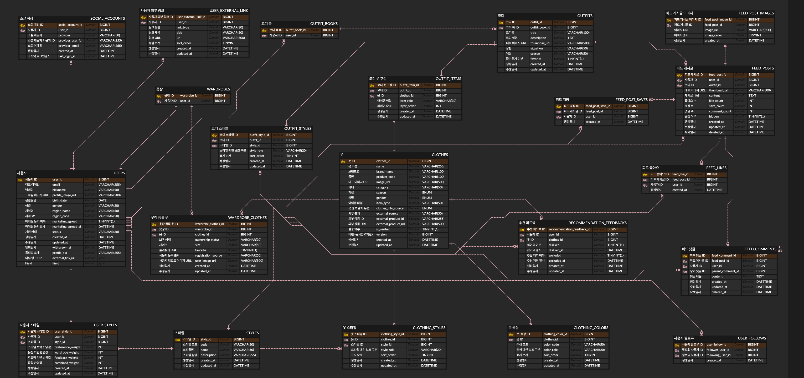

# ERD

이 문서는 옷장난감 BE의 확정 ERD v2.3 기준을 정리합니다. DB 구조와 도메인 규칙이 충돌할 때는 이 문서와 [도메인 규칙](../domain/invariants.md)을 함께 확인합니다.

## ERD 이미지

## 테이블 그룹

| 그룹 | 테이블 | 역할 |
| --- | --- | --- |
| 사용자 | `USERS` | 사용자 기본 정보, 지역, 상태, 프로필 정보 |
| 사용자 | `SOCIAL_ACCOUNTS` | OAuth 제공자별 소셜 계정 연결 |
| 사용자 | `USER_EXTERNAL_LINK` | 사용자 프로필 외부 링크 |
| 스타일 | `STYLES` | 서비스 스타일 카탈로그 |
| 스타일 | `USER_STYLES` | 사용자별 스타일 점수 |
| 옷장 | `WARDROBES` | 사용자별 단일 옷장 |
| 옷장 | `WARDROBE_CLOTHES` | 사용자 옷장과 공통 옷 정보의 연결 |
| 옷 | `CLOTHES` | 옷 자체의 공통 정보 |
| 옷 | `CLOTHING_STYLES` | 옷과 스타일의 다대다 연결 |
| 옷 | `CLOTHING_COLORS` | 옷과 색상의 다대다 연결 |
| 추천 | `RECOMMENDATION_FEEDBACKS` | 추천 싫어요와 추천 제외 피드백 |
| 코디 | `OUTFIT_BOOKS` | 사용자별 단일 코디북 |
| 코디 | `OUTFITS` | 저장된 코디 |
| 코디 | `OUTFIT_ITEMS` | 코디에 포함된 옷 목록 |
| 코디 | `OUTFIT_STYLES` | 코디 대표/보조 스타일 |
| 룩피드 | `FEED_POSTS` | 룩피드 게시글 |
| 룩피드 | `FEED_POST_IMAGES` | 피드 게시글 이미지 |
| 룩피드 | `FEED_COMMENTS` | 피드 댓글과 대댓글 |
| 룩피드 | `FEED_LIKES` | 피드 좋아요 |
| 룩피드 | `FEED_POST_SAVES` | 피드 저장 |
| 룩피드 | `USER_FOLLOWS` | 사용자 팔로우 관계 |

## 핵심 관계

| 관계 | 설명 |
| --- | --- |
| `USERS` 1 - 1 `WARDROBES` | 사용자는 1개의 옷장을 가집니다. |
| `USERS` 1 - 1 `OUTFIT_BOOKS` | 사용자는 1개의 코디북을 가집니다. |
| `WARDROBES` 1 - N `WARDROBE_CLOTHES` | 옷장에는 여러 옷장 등록 옷이 포함됩니다. |
| `CLOTHES` 1 - N `WARDROBE_CLOTHES` | 하나의 공통 옷 정보는 여러 사용자의 옷장에 연결될 수 있습니다. |
| `CLOTHES` 1 - N `CLOTHING_STYLES` | 옷 하나는 여러 스타일을 가질 수 있습니다. |
| `CLOTHES` 1 - N `CLOTHING_COLORS` | 옷 하나는 여러 색상을 가질 수 있습니다. |
| `USERS` 1 - N `USER_STYLES` | 사용자별 스타일 점수를 스타일 단위로 저장합니다. |
| `OUTFIT_BOOKS` 1 - N `OUTFITS` | 코디북에는 여러 코디가 저장됩니다. |
| `OUTFITS` 1 - N `OUTFIT_ITEMS` | 코디는 여러 옷으로 구성됩니다. |
| `OUTFITS` 1 - N `FEED_POSTS` | 룩피드 게시글은 코디를 기반으로 작성될 수 있습니다. |
| `USERS` 1 - N `RECOMMENDATION_FEEDBACKS` | 추천 피드백은 사용자별로 누적됩니다. |

## 주요 컬럼 기준

### `CLOTHES`

| 컬럼 | 의미 |
| --- | --- |
| `clothes_id` | 공통 옷 ID |
| `name` | 옷 이름 또는 상품명 |
| `brand_name` | 브랜드명 |
| `product_code` | 상품 품번 |
| `image_url` | 대표 이미지 URL |
| `category` | 옷 카테고리 코드 |
| `gender` | 옷 대상 성별 코드: `MALE`, `FEMALE`, `UNISEX`. 사용자 화면 표시 대상이 아닌 내부 분류/추천용 값 |
| `season` | 옷 자체의 대상 계절 code: `SPRING`, `SUMMER`, `FALL`, `WINTER`, `ALL_SEASON`. 옷 등록 시 1개 선택하며 생성 후 변경하지 않음 |
| `item_type` | 카테고리 하위 옷 타입 코드 |
| `clothes_info_source` | 옷 정보 출처: `PHOTO`, `PURCHASE_HISTORY`, `EXTERNAL_SHOPPING` |
| `external_source` | 외부 쇼핑몰 또는 직접 입력 출처 |
| `external_product_id` | 외부 상품 ID |
| `external_product_url` | 외부 상품 URL |
| `is_verified` | 검증된 공통 옷 정보 여부 |
| `version` | 동시성 제어용 버전 |

### `WARDROBE_CLOTHES`

| 컬럼 | 의미 |
| --- | --- |
| `wardrobe_clothes_id` | 옷장 등록 옷 ID |
| `wardrobe_id` | 사용자 옷장 ID |
| `clothes_id` | 연결된 공통 옷 ID |
| `ownership_status` | 보유 상태: `OWNED`, `WISHLIST` |
| `size` | 사용자별 사이즈 |
| `favorite` | 사용자별 즐겨찾기 여부 |
| `registration_source` | 사용자가 옷장에 등록한 경로 |
| `user_image_url` | 사용자 업로드 이미지 URL |

### `USER_STYLES`

사용자별 전체 스타일 row를 보장하고, 선택하지 않은 스타일의 `preference_weight`는 0으로 둡니다.

| 컬럼 | 의미 |
| --- | --- |
| `preference_weight` | 온보딩/마이페이지에서 사용자가 선택한 스타일 점수 |
| `wardrobe_weight` | 옷장에 등록한 옷 스타일 기반 점수 |
| `feedback_weight` | 추천 싫어요/제외 피드백 기반 점수 |
| `combined_weight` | 세 점수를 합산한 최종 스타일 점수 |

### `CLOTHING_STYLES`, `CLOTHING_COLORS`, `OUTFIT_STYLES`

| 컬럼 | 의미 |
| --- | --- |
| `style_role`, `color_role` | `PRIMARY` 또는 `SECONDARY` |
| `sort_order` | 표시 순서와 입력 순서 |

### `RECOMMENDATION_FEEDBACKS`

| 컬럼 | 의미 |
| --- | --- |
| `saved` | 저장하기 여부 |
| `saved_at` | 저장하기 시점 |
| `disliked` | 추천 싫어요 여부 |
| `disliked_at` | 추천 싫어요 시점 |
| `excluded` | 추천 제외 여부 |
| `excluded_at` | 추천 제외 시점 |

### `USERS` (프로필)

| 컬럼 | 의미 |
| --- | --- |
| `status` | 계정 상태. `ACTIVE` / `WITHDRAWN`. 탈퇴 시 `WITHDRAWN`으로 변경 |
| `withdrawn_at` | 탈퇴 처리 시각. 탈퇴 전 `1970-01-01 00:00:00` (기본값). 30일 보존 후 처리 기준 |
| `profile_bio` | 프로필 소개 문구 |
| `external_link_url` | 대표 외부 링크 URL (단일) |
| `guide_tour_completed_home` | 홈 화면 가이드 투어 완료 여부. 최초 false, 완료/건너뛰기 시 true |
| `guide_tour_completed_wardrobe` | 옷장 화면 가이드 투어 완료 여부. 최초 false, 완료/건너뛰기 시 true |
| `guide_tour_completed_feed` | 피드 화면 가이드 투어 완료 여부. 최초 false, 완료/건너뛰기 시 true |
| `guide_tour_completed_mypage` | 마이페이지 가이드 투어 완료 여부. 당분간 미사용 (마이페이지 미완성) |
| `guide_tour_completed_outfit_book` | 코디북 화면 가이드 투어 완료 여부. 당분간 미사용 (코디북 미완성) |

### `SOCIAL_ACCOUNTS`

| 컬럼 | 의미 |
| --- | --- |
| `created_at` | OAuth 계정 최초 연결 시각 |
| `last_login_at` | 마지막 로그인 시각 |

`updated_at`은 ERD에 없으며 BE `SocialAccount` 엔티티에도 매핑하지 않습니다.

### `USER_EXTERNAL_LINKS`

| 컬럼 | 의미 |
| --- | --- |
| `link_type` | 링크 유형 코드 |
| `title` | 표시 제목 |
| `url` | 외부 URL |
| `sort_order` | 프로필 노출 순서 |

## BE 구현 범위 (ERD v2.3 명칭 정합)

| 대상 | BE 엔티티 | 비고 |
| --- | --- | --- |
| `USERS` | `User` | `profile_bio`, `external_link_url`, `guide_tour_completed_*` 매핑 완료 |
| `SOCIAL_ACCOUNTS` | `SocialAccount` | `created_at` + `last_login_at`만 매핑 |
| `USER_EXTERNAL_LINKS` | `UserExternalLink` | 엔티티·Repository만. **마이페이지 CRUD API는 후속 (USER-002)** |
| `FEED_*`, `USER_FOLLOWS` | 미구현 | 엔티티 셸 또는 없음. 룩피드 도메인 후속 |
| `RECOMMENDATION_FEEDBACKS` | `RecommendationFeedback` | saved/disliked/excluded 피드백 구현 완료 |

## 데이터 보존 기준

- `CLOTHES`는 공통 옷 정보이므로 사용자 옷장 삭제와 함께 삭제하지 않습니다.
- 사용자가 옷장에서 옷을 삭제하면 `WARDROBE_CLOTHES` 연결만 제거하거나 비활성화합니다.
- 공통 옷 정보와 대표 이미지는 추천 품질 향상을 위한 서비스 데이터로 유지합니다.
- 옷의 계절은 `CLOTHES.season`에 저장하는 공통 옷 정보입니다.
- 옷마다 계절은 1개만 부여하며, 옷 등록 시 선택한 뒤 생성된 옷의 계절은 변경하지 않습니다.
- 사용자별 사이즈, 즐겨찾기, 보유 상태는 공통 옷 정보가 아니라 `WARDROBE_CLOTHES`에 저장합니다.
